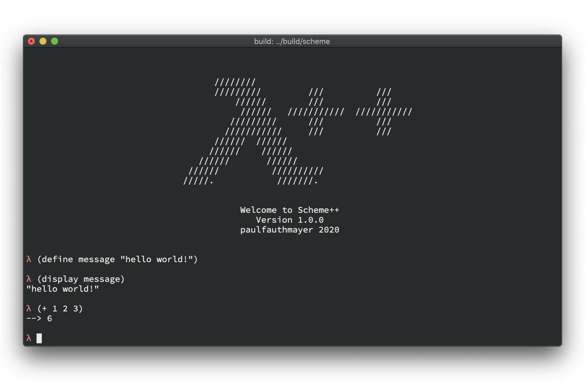

# Scheme++



## Build Instructions

The build process should be relatively straight foreward, thanks to the included CMake instructions.
I used a Macbook running macOS Catalina 10.15.6 during the development of this interpreter.
Thus I cannot vouch for any other operating systems but I don't see why it shouldn't work :)

```bash
> cd <repo>
> mkdir build
> cd build
> cmake ..
> make
> ./scheme
```

Please also note that this was my first time writing anything substantial in C++. Weird language, especially when coming from python. Nonetheless, this was quite fun but in equal measures also frustrating. Well worth it though!


---

## Design Philosophy

* **free functions** over class functions
  * I generally like to stay as close to functional programming as possible - in this case meaning that I use classes and structs exclusively as data containers / data types. Relevant functionality is provided by free (friend) functions instead and lambdas are made use of where sensible. As my colleague Nils put it:
    > "good c++ code basically looks like c with more **::** thrown into the mix".
* **readability** over performance
  * in the end, I don't care too much about how performant my solution is - if there's need for it, this can be done later. In the meantime, I'm going to gain a lot more from having code that others (and future me) can understand.
* **regex** based parser
  * I've got a faible for regular expressions, so I thought this was fitting. Probably not the most performant of all options, but readable and concise.
* as **DRY** as possible
  * if I can represent a syntax in a combination of other syntaxes, I'll do it. This reduces potential sources of logic errors. Examples include:

    ```scheme
    (define
      (plus1 x)
        (display "hello there!")
        (display "general kenobi!")
        (+ x 1))

    ;; is treated like

    (define plus1
      (lambda  (x)
        (begin
          (display "hello there!")
          (display "general kenobi!")
          (+ x 1))))
    ```

* **pure** C++
  * except for [loguru](https://github.com/emilk/loguru), an awesome, simple logging library, I'm staying clear of any non-standard libraries. In parts for simplicity, in other parts because I wanted to learn the language and not specific libraries.

---

## Functionality

* a range of data types
* a range of builtin functions and syntax, see below
* user defined functions
* tail call optimizition via *trampolining* for longer possible recursions
* lazy expression execution for single line expressions

    ```scheme
    + 1 2 3  
    ;; gets expanded to
    ( + 1 2 3 )
    ```

* lazy function definition

    ```scheme
    (define (plus1 x) (+ x 1))
    ;; instead of 
    (define plus1 (lambda (x) (+ x 1)))
    ```
  
* run `.scm` files on their own by passing it via the cli! `scheme myscript.scm`
* type `exit!` to close repl
* type `help` to show all currently available functions and variables

  ``` scheme
  > help
  ======== SYNTAX ========
  quote            :=  #<syntax:quote>
  if               :=  #<syntax:if>
  define           :=  #<syntax:define>
  set!             :=  #<syntax:set!>
  lambda           :=  #<syntax:lambda>
  begin            :=  #<syntax:begin>
  help             :=  #<syntax:help>
  def              :=  #<syntax:define>
  ======== FUNCTIONS ========
  +                :=  #<primitive:+>
  -                :=  #<primitive:->
  *                :=  #<primitive:*>
  /                :=  #<primitive:/>
                  ....
  ```

* type `(help <function-name>)` to get function/syntax specific help messages

    ``` scheme
    > (help +)
    adds multiple numbers and/or strings
      (+ 1 2 3) -> 6
      (+ 1 2 2.5) -> 5.5
      (+ "hello " "world!") -> "hello world!"
      (+ "hello " 1 " world!") -> "hello 1 world!"
    priority: string > float > integer
    ```

### Data Types

* numbers (integers & floats)
* strings
* lists / cons
* booleans
* nil '()
* user defined functions

### Supported Syntax

| syntax                   |       symbol       | type     | example                              |                                                    result |
|--------------------------|:------------------:|----------|--------------------------------------|----------------------------------------------------------:|
| begin                    |       `begin`      | syntax   | `(begin`<br/>`(+ 1 1)`<br/>`(+ 2 2))`            |                                                       `4` |
| define                   |      `define`      | syntax   | `(define a 10)`                      |                              defines variable `a` as `10` |
| set                      |       `set!`       | syntax   | `(set! a 10)`                        | defines `a` as `10` in current and all paren environments |
| if                       |        `if`        | syntax   | `(if 1 (+ 1 1) (+ 2 2))`             |                                                       `4` |
| quote                    |       `quote`      | syntax   | `(quote 1 2 3)`<br>`(quote (1 2 3))` |                                          `1`<br>`(1 2 3)` |
| lambda                   |      `lambda`      | syntax   | `(lambda (x y) (+ x 1))`             | creates new user defined function                                           |
| help                     | `help`             | syntax   | `(help)`<br>`(help +)`               | shows all bindings<br>shows help text for passed function |
| exit                     | `exit!`            | keyword  | `exit!`                              | exits the scheme repl elegantly                           |


### Functions

| function                 |       symbol       | type    | example                              |                                                    result |
|--------------------------|:------------------:|---------|--------------------------------------|----------------------------------------------------------:|
| addition                 |         `+`        | builtin | `(+ 1 2 5)`                          |                                                       `8` |
| subtraction              |         `-`        | builtin | `(- 10 5)`                           |                                                       `5` |
| multiplication           |         `*`        | builtin | `(* 2 2)`                            |                                                       `4` |
| division                 |         `/`        | builtin | `(/ 5 2)`<br/>`(/ 6 2)`              |                                             `2.5`<br/>`3` |
| modulo                   |         `%`        | udf     | `(% 5 2)`                            |                                                       `1` |
| power of n               | `pow`              | udf     | `(pow 10 3)`                         | `1000`                                                    |
| greater than             |         `>`        | udf     | `(> 5 2)`                            |                                                      `#t` |
| lesser than              |         `<`        | builtin | `(< 5 2)`                            |                                                      `#f` |
| greater than or equal    |        `>=`        | udf     | `(>= 5 5)`                           |                                                      `#t` |
| lesser than or equal     |        `<=`        | udf     | `(<= 5 5)`                           |                                                      `#t` |
| equal numbers            |         `=`        | builtin | `(= 1 11)`                           |                                                      `#f` |
| equal strings            |   `equal-string?`  | builtin | `(equal-string? "a" "a")`            |                                                      `#t` |
| equal objects            | `eq?`              | builtin | `(eq? 1 1)`                          | `#f`                                                      |
| equal?                   |      `equal?`      | udf     | `(equal? 1.0 0)`                     |                                                      `#t` |
| list                     |       `list`       | builtin | `(list 1 2 3)`                       |                                                 `(1 2 3)` |
| cons                     |       `cons`       | builtin | `(cons 1 '(2 3))`                    |                                                 `(1 2 3)` |
| car                      |        `car`       | builtin | `(car '(1 2 3))`                     |                                                       `1` |
| cdr                      |        `cdr`       | builtin | `(cdr '(1 2 3))`                     |                                                   `(2 3)` |
| function arglist         | `function-arglist` | builtin | `(function-arglist plus1)`           | `(x)`                                                     |
| function body            | `function-body`    | builtin | `(function-body plus1)`              | `(+ x 1)`                                                 |
| to bool                  |      `to-bool`     | udf     | `(to-bool 1)`<br>`(to-bool 0)`       |                                              `#t`<br>`#f` |
| not                      |        `not`       | udf     | `(not #t)`                           |                                                      `#f` |
| and                      |        `and`       | udf     | `(and #t #f)`                        |                                                      `#f` |
| or                       |        `or`        | udf     | `(or #t #f)`                         |                                                      `#t` |
| xor                      |        `xor`       | udf     | `(xor #t #t)`                        |                                                      `#f` |
| nand                     |       `nand`       | udf     | `(nand 0 0)`                         |                                                      `#t` |
| is string                |      `string?`     | builtin | `(string? "asd")`                    |                                                      `#t` |
| is number                |      `number?`     | builtin | `(number? 0)`                        |                                                      `#t` |
| is cons                  |       `cons?`      | builtin | `(cons? '(1 2 3))`                   |                                                      `#t` |
| is function              |     `function?`    | builtin | `(function? +)`                      |                                                      `#t` |
| is user defined function |  `user-function?`  | builtin | `(user-function? +)`                 |                                                      `#f` |
| is real bool value       |       `bool?`      | builtin | `(bool? 1)`<br/>`(bool? #f)`         |                                             `#f`<br/>`#t` |
| display                  |      `display`     | builtin | `(display 1)`                        |                                              displays `1` |
| minimum                  |        `min`       | udf     | `(min 4 1)`                          |                                                       `1` |
| maximum                  |        `max`       | udf     | `(max 4 1)`                          |                                                       `4` |
| for loop                 |     `for-loop`     | udf     | `(for-loop 0 10 diplay)`             |                                      displays `0` ... `9` |
| factorial                |     `factorial`    | udf     | `(factorial 4)`                      |                                                      `10` |
| fibonacci                |        `fib`       | udf     | `(fib 10)`                           |                                                      `55` |

### In Process

* code optimisation
* garbage collection
* full unit test coverage

---

## Wanna Dos

* curses based interface
  * text manipulation is atm not great (can't move the curser left or right except via deleting the current input
  * can't press up to get past input
  * limited possibilities for visualization
  * no tab-completion
  * implement whole UI in a curses library could make this a lot more usable
* new vector data type
